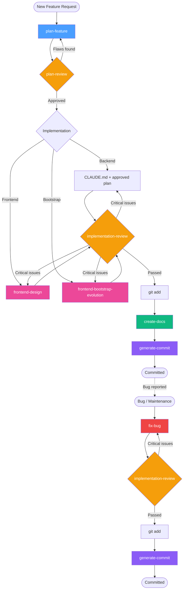

# Coding Agent Skills

A collection of Claude Code skills and guidelines for disciplined feature development. Designed to reduce over-engineering, enforce simplicity, and maintain a structured workflow from planning through documentation.

## Structure

```
coding-agent-skills/
├── CLAUDE.md                          # Coding behavior guidelines
├── skills/
│   ├── plan-feature/SKILL.md             # Create implementation plans
│   ├── plan-review/SKILL.md          # Review and iterate on plans
│   ├── implementation-review/SKILL.md # Review code for bugs and flaws
│   ├── create-docs/SKILL.md          # Generate feature documentation
│   ├── generate-commit/SKILL.md      # Generate conventional commit messages
│   ├── fix-bug/SKILL.md             # Diagnose and fix bugs (reproduce-first)
│   ├── frontend-design/SKILL.md      # Distinctive, production-grade frontend interfaces
│   └── frontend-bootstrap-evolution/  # Bootstrap 5 frontend skill
```

## Workflow

The skills follow a linear development workflow:



| Step | Skill | What it does |
|------|-------|-------------|
| 1. Plan | `plan-feature` | Creates a focused implementation plan in `plans/` |
| 2. Review plan | `plan-review` | Reviews the plan for flaws, over-engineering, feasibility. Run multiple times — each pass logs changes to the plan file |
| 3. Implement | *(guided by CLAUDE.md + the approved plan)* | |
| 3a. Implement (frontend) | `frontend-design` | Implements frontend features with distinctive design quality. Reads the approved plan and review log before coding |
| 3b. Implement (Bootstrap) | `frontend-bootstrap-evolution` | Implements frontend using Bootstrap 5 with heavily customized, "un-bootstrapped" aesthetics |
| 4. Review implementation | `implementation-review` | Reviews code for bugs, security issues, plan deviations. Auto-fixes critical issues, reports the rest |
| 5. Create docs | `create-docs` | Generates documentation from the plan and staged changes |
| 6. Commit | `generate-commit` | Generates a conventional commit message from staged diff |

## CLAUDE.md

The `CLAUDE.md` file provides behavioral guidelines that apply across all steps:

1. **Think Before Coding** — surface assumptions, ask when unclear
2. **Plan for Delivery, Not Perfection** — scope tight, ship small
3. **Simplicity First** — minimum code, nothing speculative
4. **Surgical Changes** — touch only what you must
5. **Goal-Driven Execution** — define success criteria, loop until verified

## Installation

Copy the skills you need into your project's `.claude/skills/` directory:

```bash
# Copy all skills
cp -r skills/* /path/to/your-project/.claude/skills/

# Copy specific skills only
cp -r skills/plan-feature /path/to/your-project/.claude/skills/
cp -r skills/fix-bug /path/to/your-project/.claude/skills/
```

### CLAUDE.md Setup

Place the behavioral guidelines in `.claude/CLAUDE.md` — this keeps them separate from your project-specific `CLAUDE.md` at the root. Claude Code reads both files automatically.

```
your-project/
├── CLAUDE.md                    # Project-specific (framework, commands, architecture)
└── .claude/
    ├── CLAUDE.md                # Behavioral guidelines (from coding-agent-skills)
    └── skills/                  # Skills copied here
```

```bash
# Install behavioral guidelines (won't conflict with project CLAUDE.md)
cp CLAUDE.md /path/to/your-project/.claude/CLAUDE.md
```

If your project doesn't have a root `CLAUDE.md`, you can copy directly to the root instead:

```bash
cp CLAUDE.md /path/to/your-project/CLAUDE.md
```

## Design Principles

- **Slim over heavyweight** — plans and reviews scale to the size of the change, not one-size-fits-all
- **Anti-over-engineering** — every skill actively checks for unnecessary complexity
- **Iterative** — plans get reviewed multiple times with a change log, not approved in one pass
- **Code is source of truth** — docs and commits are based on what was built, not what was planned
- **Stage first** — docs and commits require staged changes before running

## Credits

- `CLAUDE.md` is derived from [multica-ai/andrej-karpathy-skills](https://github.com/multica-ai/andrej-karpathy-skills/blob/main/CLAUDE.md)
- `skills/frontend-design/SKILL.md` is derived from [anthropics/skills](https://github.com/anthropics/skills/blob/main/skills/frontend-design/SKILL.md)
