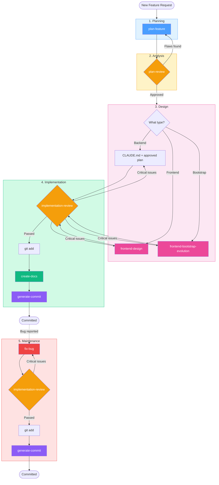

# Coding Agent Skills

A collection of Claude Code skills and guidelines for disciplined feature development. Designed to reduce over-engineering, enforce simplicity, and maintain a structured workflow from planning through documentation.

## Structure

```
coding-agent-skills/
├── CLAUDE.md                          # Coding behavior guidelines
├── CLAUDE-template.md                 # Project-specific CLAUDE.md skeleton
├── skills/
│   ├── plan-feature/SKILL.md             # Create implementation plans
│   ├── plan-review/SKILL.md          # Review and iterate on plans
│   ├── implementation-review/SKILL.md # Review code for bugs and flaws
│   ├── create-docs/SKILL.md          # Generate feature documentation
│   ├── generate-commit/SKILL.md      # Generate conventional commit messages
│   ├── fix-bug/SKILL.md             # Diagnose and fix bugs (reproduce-first)
│   ├── frontend-design/SKILL.md      # Distinctive, production-grade frontend interfaces
│   └── frontend-bootstrap-evolution/  # Bootstrap 5 frontend skill
```

## Workflow

The skills follow the SDLC phases:



| SDLC Phase | Skill | What it does |
|------------|-------|-------------|
| **1. Planning** | `plan-feature` | Creates a focused implementation plan in `plans/` |
| **2. Analysis** | `plan-review` | Reviews the plan for flaws, over-engineering, feasibility. Run multiple times — each pass logs changes to the plan file |
| **3. Design** | `frontend-design` / `frontend-bootstrap-evolution` | For frontend features only. Backend work follows CLAUDE.md guidelines directly |
| **4. Implementation** | `implementation-review` → `create-docs` → `generate-commit` | Review code (2x), generate docs from staged changes, commit with conventional message |
| **5. Maintenance** | `fix-bug` | Reproduce-first bug fixing. Skips phases 1-3 |

## CLAUDE.md

The `CLAUDE.md` file provides behavioral guidelines that apply across all steps:

1. **Think Before Coding** — surface assumptions, ask when unclear
2. **Plan for Delivery, Not Perfection** — scope tight, ship small
3. **Simplicity First** — minimum code, nothing speculative
4. **Surgical Changes** — touch only what you must
5. **Goal-Driven Execution** — define success criteria, loop until verified

## Installation

Pick the instructions for your tool:

### pi

```bash
# 1. Global behavioral guidelines (applied to every project)
mkdir -p ~/.pi/agent
cp CLAUDE.md ~/.pi/agent/AGENTS.md

# 2. Global skills (available in every project)
mkdir -p ~/.pi/agent/skills
for dir in skills/*/; do ln -s "$(realpath "$dir")" ~/.pi/agent/skills/; done

# 3. Per-project config (fill in the template)
cp CLAUDE-template.md /path/to/your-project/CLAUDE.md
```

Skills auto-discover at next pi startup. Or symlink manually:
- Context file: `~/.pi/agent/AGENTS.md`
- Skills: `~/.pi/agent/skills/<skill-name>/`
- Project skills: `.pi/skills/<skill-name>/`

### Claude Code

```bash
# Copy all skills
cp -r skills/* /path/to/your-project/.claude/skills/

# Or copy specific skills only
cp -r skills/plan-feature /path/to/your-project/.claude/skills/
cp -r skills/fix-bug /path/to/your-project/.claude/skills/

# Behavioral guidelines → .claude/CLAUDE.md
cp CLAUDE.md /path/to/your-project/.claude/CLAUDE.md

# Project-specific config → root CLAUDE.md (fill in the template)
cp CLAUDE-template.md /path/to/your-project/CLAUDE.md
```

### File Placement by Tool

Different AI coding tools use different file names and locations. The content is the same — only the file name and path differ.

#### pi

Reference: [Pi docs](https://github.com/badlogic/pi-skills)

```
your-project/
├── CLAUDE.md                    # Project-specific (from CLAUDE-template.md)
└── .pi/
    └── skills/                  # Skills copied or symlinked here
```

pi loads **context files** (`CLAUDE.md` or `AGENTS.md`) from the current directory and walks up the tree. For global instructions that apply to every project:

```bash
# Global behavioral guidelines (~/.pi/agent/AGENTS.md)
mkdir -p ~/.pi/agent
cp CLAUDE.md ~/.pi/agent/AGENTS.md

# Global skills (~/.pi/agent/skills/)
mkdir -p ~/.pi/agent/skills
cp -r skills/* ~/.pi/agent/skills/
# Or symlink to keep them in sync:
# ln -s /absolute/path/to/coding-agent-skills/skills/* ~/.pi/agent/skills/
```

Project skills are discovered from `.pi/skills/` (and `.agents/skills/`) in the current directory and ancestor directories. pi also supports loading skills from other tools:

```json
// ~/.pi/settings.json
{
  "skills": ["~/.claude/skills", "~/.codex/skills"]
}
```

| What | pi Location | Notes |
|------|-------------|-------|
| Global instructions | `~/.pi/agent/AGENTS.md` | Also accepts `CLAUDE.md` |
| Project instructions | `CLAUDE.md` / `AGENTS.md` in cwd & ancestors | Auto-discovered |
| Global skills | `~/.pi/agent/skills/` or `~/.agents/skills/` | Recursively discovers `SKILL.md` directories |
| Project skills | `.pi/skills/` or `.agents/skills/` | Auto-discovered after project trust |
| One-off skill | `pi --skill /path/to/skill` | CLI flag, additive |

#### Claude Code

Reference: [claude.com/docs/en/memory](https://code.claude.com/docs/en/memory)

```
your-project/
├── CLAUDE.md                    # Project-specific (from CLAUDE-template.md)
├── CLAUDE.local.md              # Personal overrides (add to .gitignore)
└── .claude/
    ├── CLAUDE.md                # Behavioral guidelines (from CLAUDE.md)
    └── skills/                  # Skills copied here
```

Claude Code reads all `CLAUDE.md` files walking up the directory tree. Both root and `.claude/CLAUDE.md` are loaded automatically. Use `CLAUDE.local.md` for personal preferences not shared with the team.

User-level (all projects): `~/.claude/CLAUDE.md`

#### OpenCode

Reference: [opencode.ai/docs/rules](https://opencode.ai/docs/rules/)

```
your-project/
├── AGENTS.md                    # Project-specific (from CLAUDE-template.md, renamed)
└── .claude/
    └── skills/                  # Skills copied here
```

OpenCode uses `AGENTS.md` as the primary file name. It falls back to `CLAUDE.md` if no `AGENTS.md` exists. If using both tools, keep `CLAUDE.md` — OpenCode will pick it up as fallback.

User-level (all projects): `~/.config/opencode/AGENTS.md`

#### Other Tools

For tools that support custom instruction files (Cursor, Windsurf, Codex, etc.), copy the behavioral guidelines and project config into their respective instruction file format. The content is tool-agnostic.

## Design Principles

- **Slim over heavyweight** — plans and reviews scale to the size of the change, not one-size-fits-all
- **Anti-over-engineering** — every skill actively checks for unnecessary complexity
- **Iterative** — plans get reviewed multiple times with a change log, not approved in one pass
- **Code is source of truth** — docs and commits are based on what was built, not what was planned
- **Stage first** — docs and commits require staged changes before running

## Credits

- `CLAUDE.md` is derived from [multica-ai/andrej-karpathy-skills](https://github.com/multica-ai/andrej-karpathy-skills/blob/main/CLAUDE.md)
- `skills/frontend-design/SKILL.md` is derived from [anthropics/skills](https://github.com/anthropics/skills/blob/main/skills/frontend-design/SKILL.md)
